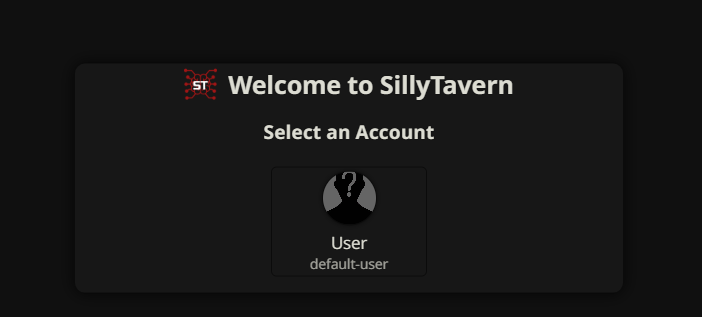
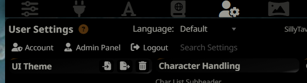
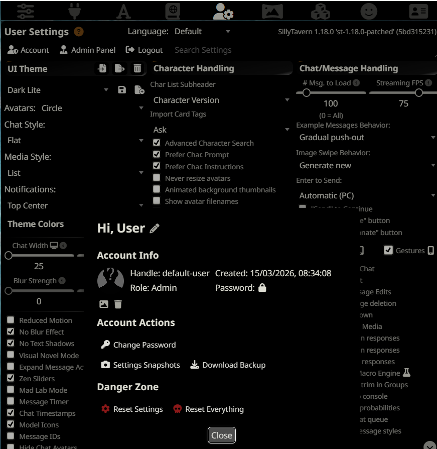
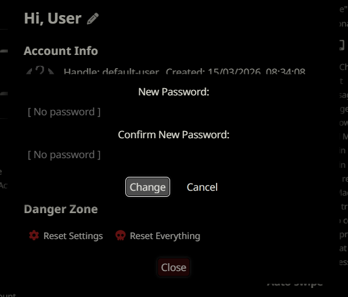
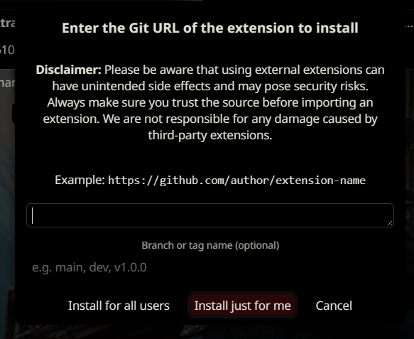

# SillyTavern-Securityze

SillyTavern has no built-in inactivity timeout. If you walk away from an open tab, anyone who finds it can read your chats. Securityze fixes that by locking the screen after a period of inactivity and requiring your account password to continue.

---

## Login vs Lock Screen

These are two different things and Securityze uses both.

**Login screen** — ST's own login page, shown when there is no active session. This is what you see when you first open ST, or after a real logout.



**Lock screen** — Securityze's overlay. Shown after idle timeout while you are already logged in. The session stays alive underneath so the page does not need to reload — a full login reloads all characters, chats, and settings from scratch, which takes time. On unlock you continue exactly where you left off.


If you press F5 or close the tab while locked, the session is terminated server-side and you land on the login screen instead.

---

## Requirements

**1. User accounts must be enabled** in `config.yaml`:

```yaml
enableUserAccounts: true
```

Without this, ST has no real authentication. Logout is a no-op and the lock does nothing.

**2. Your account must have a password set.** Without a password, ST auto-logs in on every page load, bypassing the lock entirely.

Open User Settings via the person icon in the top bar, then click **Admin Panel**:



Click your user to open Account Info, then **Change Password**:



Enter and confirm your new password:



---

## Installation

In ST, open Extensions → Manage Extensions → Install from URL. Enter:

```
https://github.com/ZapoVerde/SillyTavern-Securityze
```



---

## Configuration

Open **Extensions → Securityze** in the ST UI.

| Setting | Description | Default |
|---|---|---|
| Enable idle lock | Turns the lock on or off without uninstalling | On |
| Lock after N minutes | How long before the lock activates | 5 minutes |

The timeout resets on any mouse, keyboard, touch, scroll, or click event. Settings are stored in `localStorage` per browser, so each device can have a different timeout.

You can also lock immediately at any time by typing `/szlock` in the chat input.

---

## Locked Out?

If you forget your password, use ST's built-in recovery flow:

1. On the login screen, click your user account to get to the password prompt
2. Click **Forgot password?**
3. A recovery code is posted to your **server console** (terminal or Docker logs)
4. Enter the code and your new password to regain access

The recovery code only appears in the server console — someone who only has browser access cannot use this flow.

---

## License

AGPL-3.0 — see [LICENSE](LICENSE)
